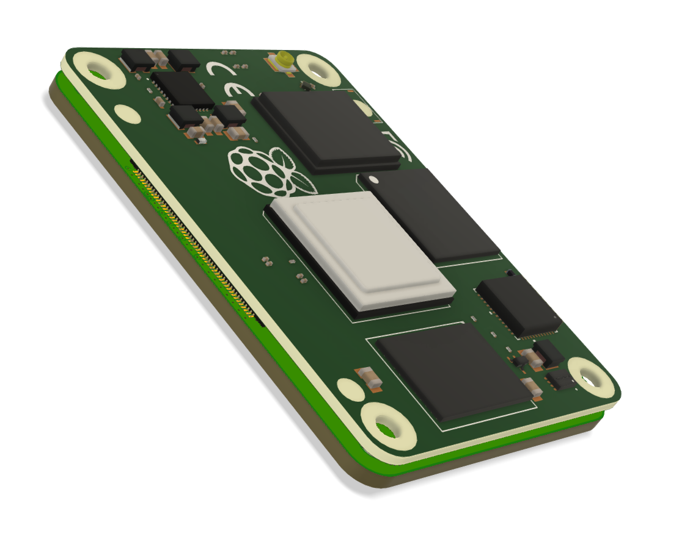
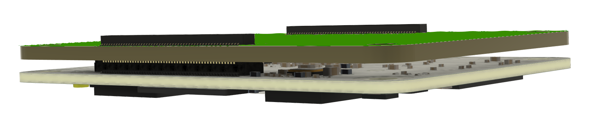
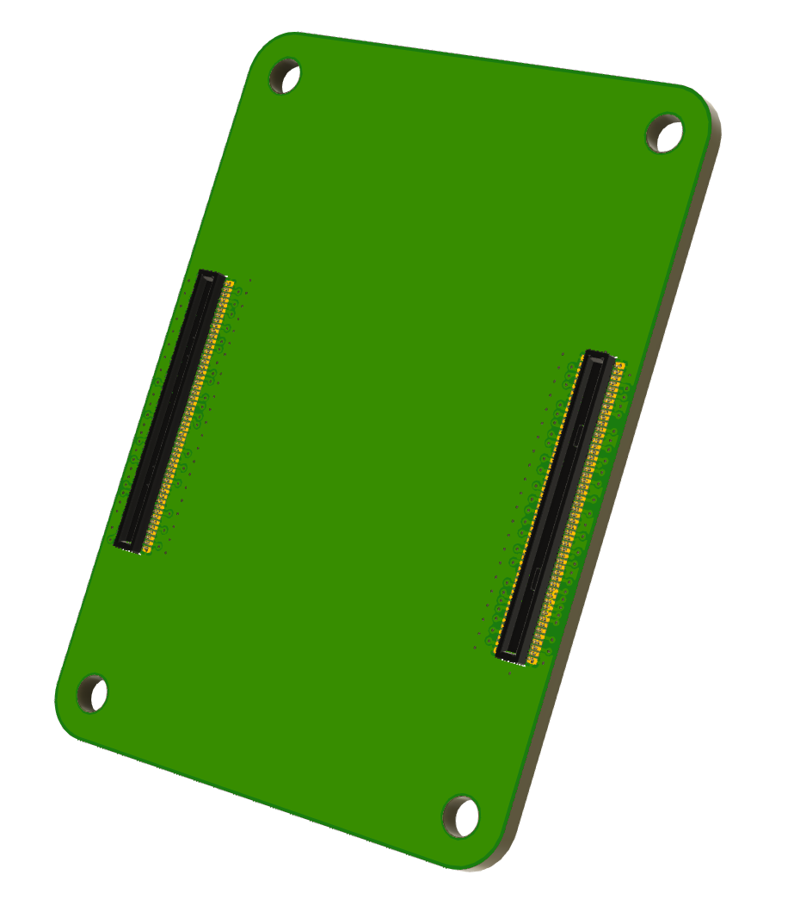

CM4 Interposer
===
Untested design as of 12th September 2021
---

A PCB that helps save the connector cycles on a CM4 by passing through its connection to a second set of Hirose connectors.

Needs:
- 2x DF40C-100DS-0.4V(51)
- 2x DF40C-100DP-0.4V(51)

